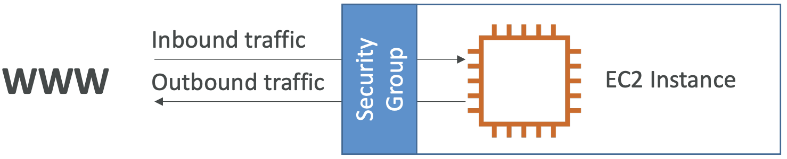
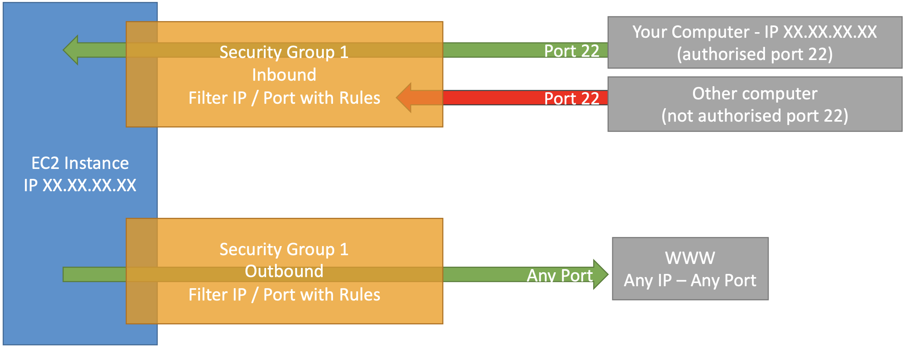
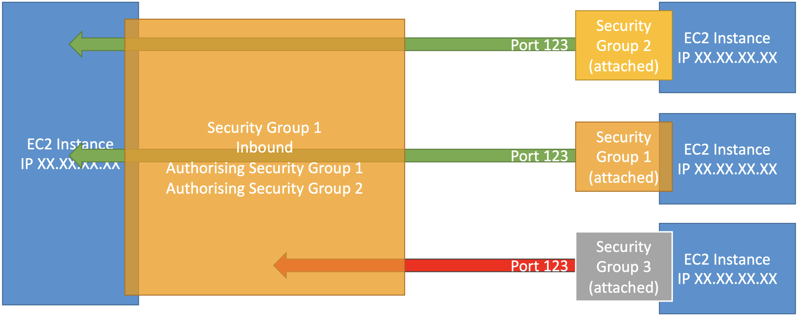

# Accounts

- An AWS account is a container for identities (users) and resources
- when creating an aws account you provide an account name (prod), a unique email address, and a credit card
- each aws account comes with a root user that can only log into that account
- the account root user has full control over everything and isn't restricted

## Benefits
- contains any damage caused in a specific account (bad actor with leaked credentials)
- good for keeping things outside boundary - all access to an aws account is denied by default

**Basics**  


**Example**    


**Referencing Other Security Groups**  


### Classic Ports
- 22: SSH (secure shell) - log into a Linux instance
- 21: FTP (file transfer protocol) - upload files into a file share
- 22: SFTP (secure file transfer protocol) - upload files with SSH
- 80: HTTP - access unsecure websites
- 443: HTTPS - access secure websites
- 3389: RDP (remote desktop protocol) - log into Windows instance

#### SSH
- Allows control of remote machine
- Must use private key with 0400 access permissions
- Permissions 0644 error: access is too open (accessible to public)
    - Fix with `chmod 0400 <PEM FILEPATH>`

```
ssh ec2-user@<PUBLIC IPv4> # Permission denied
ssh -i <PEM FILEPATH> ec2-user@<PUBLIC IPv4> # SSH with private key
```

## Instances Purchasing Options

### On-Demand
- Predictable pricing (pay for what you use)
    - Linux and Windows: billing per second, after first minute
    - Other: billing per hour
- Highest cost
- No upfront payment
- No long-term commitment
- Recommended for:
    - **Short-term** and **un-interrupted** workloads
    - Can't predict how application will behave

### Reserved Instances
- Up to 75% discount compare to on-demand
- Must choose specific instance type
- Reservation period:
    - 1 year
    - 3 years (larger discount)
- Purchasing Options:
    - No upfront
    - Partial upfront (discounted)
    - All upfront (biggest discount)
- Recommended for: steady-state usage applications (e.g. databases)

#### Convertible Reserved Instance
- Can change the instance type and other parameters
- Up to 54% discount

#### Scheduled Reserved Instance
- Deprecated
- Only running/launched during a reserved time window (e.g. every Thursday, 3 - 6 PM)
- Recommended for: applications running for fraction of day / week / month

### Spot Instances
- Up to 90% discount compared to on-demand
- Most cost-efficient instances
- Can lose at any point in time if set max price is less than current spot price
- Recommended for: workloads resilient to failure
- Examples:
    - Batch jobs
    - Data analysis
    - Image processing
    - Any distributed workloads
    - Workloads with flexible start and end time
- Not recommended for: critical jobs or databases

### Dedicated Hosts
- Entire physical server dedicated to your own use
- Helps address **compliance requirements**
- Allows to **use your existing server-bound software licenses**
- Control instance placement
- 3 year reservation period
- More expensive
- Recommended for:
    - Software with complicated licensing model or "Bring Your Own License"
    - Strong regulatory or compliance needs

### Dedicated Instances
- Hardware dedicated to your own use
- Can share hardware with instances in same account
- No control over instance placement (hardware can move)
- No control over underlying hardware
