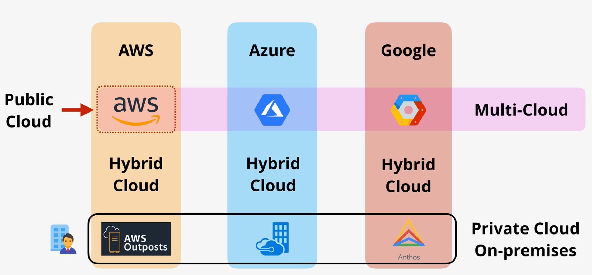
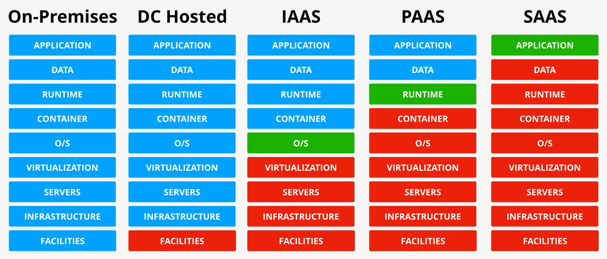

# Cloud Computing

## Characteristics
- On-Demand Self-Service: provision capabilities as needed _without requiring human interaction_
  - On Azure, AWS, or Google, we're able to provision new resources either through console or programmatically and it will be ready immediately
- Broad Network Access: capabilities are available over the network and accessed through standard mechanisms (e.g. VPN, HTTP, SSH)
- Resource Pooling
  - There is a sense of location independence
  - No control or knowledge over the exact location of the resources
  - Resources are pooled to serve multiple consumers using a multi-tenant model
  - Vendor is free to use whatever hardware or data center it wants
- Rapid Elasticity
  - Capabilities can be elastically provisioned and released to scale rapidly outward and inward with demand
  - To the consumer, the capabilities available for provisioning often appear to be unlimited
  - System can scale up or down depending on the demand in real time
- Measured Service
  - Resource usage can be monitored, controlled, reported, and billed
  - On-demand billing
  - You pay for what you use (e.g. hours, minutes, gigabytes)

## Variations
- Public Cloud: cloud environment available to the public
- Multi-cloud: using multiple public cloud environments
  - Abstracts away from individual environments
  - Relies on lowest common feature set
  - Best for high availability
- Private Cloud On-Premises : private and dedicated to your business; run on premises
- Hybrid Cloud: private and public cloud as unified platform
  - **Not public cloud mixed with legacy on-premises hardware (this is hybrid environment)**

## Service Models
- Definition of what service you receive from a product
- Which parts of infrastructure stack you are responsible for and which the vendor manages
- Defines your unit of consumption (which you pay for)
- Infrastructure stack - collection of things that an app needs
  - Facilities - physical building with power, air control, physical security
  - Infrastructure - storage and networking
  - Servers - physical servers
  - Virtualization - allows for virtual machines
  - Operating System
  - Container - e.g. Docker
  - Runtime - language-specific runtime environment (e.g. Java, Python)
  - Data
  - Application

### Variations
- On-Premises
  - Very flexible
  - Tailor-made for business
- Data Center Hosted
- Infrastructure as a Service
  - Most popular
  - General pay for use of VM
  - Limited to vendor's VM sizes and capabilities
  - Reduces cost and risk
  - e.g. AWS
- Platform as a Service
  - Only care about the application that's running
  - Don't worry about any infrastructure
- Software as a Service
  - Only pay for the consuming the service
  - e.g. Netflix, Dropbox
