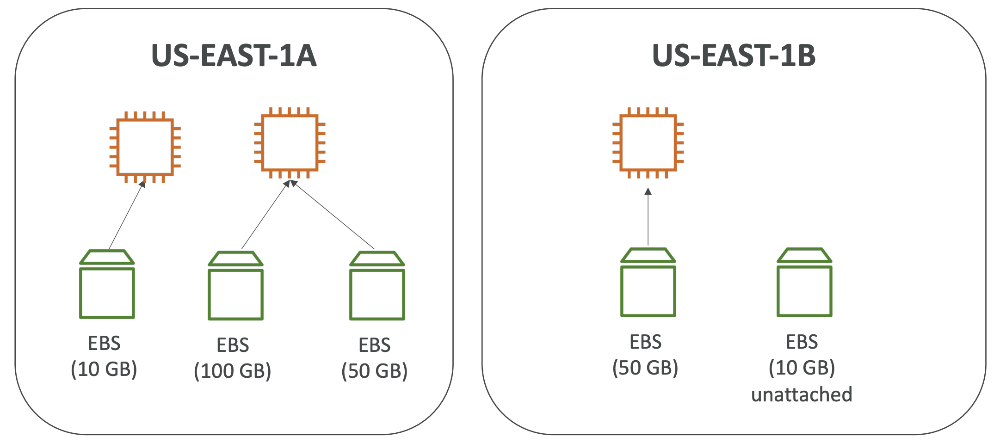
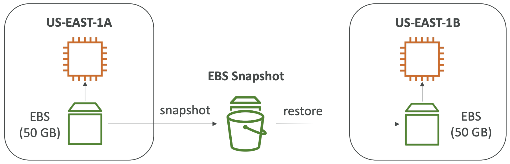
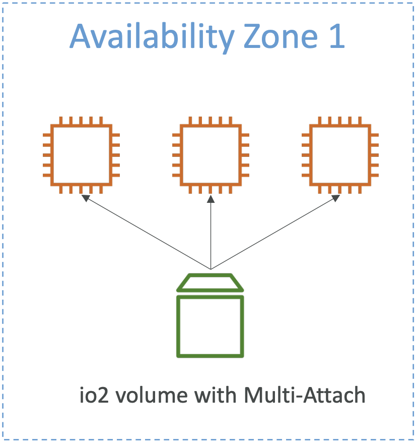
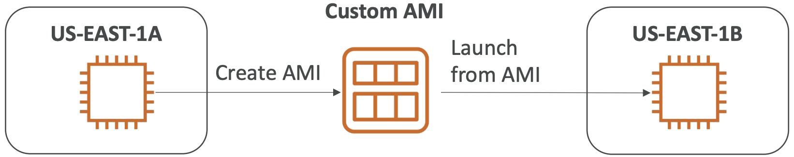
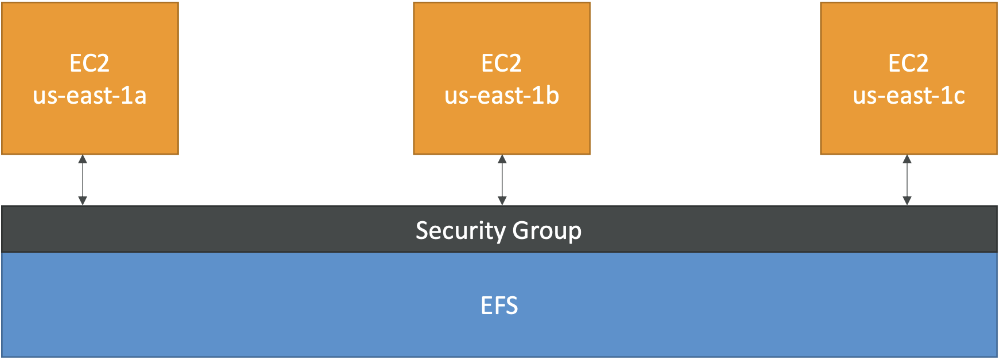

# EC2 Storage

## Elastic Block Storage (EBS) Volume
- Network drive (not physical) that attaches to instances
- Uses network to communicate (some latency)
- Persists data (even after termination)
- Limited performance
- Locked to specific availability zone
- Must provision capacity
  - Size in GBs and I/O operations per second (IOPS)
  - Can increase capacity over time
- Can only be attached to 1 instance at a time (unless using multi-attach enabled EBS)
  

### Delete on Termination Attribute
- Controls EBS behavior when EC2 instance terminates
- **Default: `on` for root volume, `off` for other EBS volumes**
- Can update using console or CLI
- Example: Disable attribute when you want to preserve root volume when instance is terminated to preserve data

### Snapshots
- Backup (snapshot) EBS volume at any point in time
- Recommended (but not necessary) to detach volume before snapshot
- Copy snapshots across AZ or region

### Volume Types
EBS volumes characterized by:
- Size
- Throughput
- IOPS

__Only gp2/gp3 and io1/io2 can be used as boot volumes (root OS runtime)!__

**gp2 / gp3 (SSD)**
- General purpose
- Balances price and performance for variety for workloads

**io 1 / io 2 (SSD)**
- Highest performance
- Mission critical
- Low-latency or high-throughput workloads
- [Multi-attach feature](https://docs.aws.amazon.com/AWSEC2/latest/UserGuide/ebs-volumes-multi.html):
  - Allow same EBS volume to attach to multiple EC2 instances in same AZ
  - Full read and write permissions
  - Must use cluster-aware file system
  - Useful for:
    - Higher application availability in clustered Linux applications (e.g. Teradata)
    - Applications must handle concurrent write operations
    

**st 1 (HDD)**
- Low cost
- Frequently accessed
- Throughput intensive workloads

**sc 1 (HHD)**
- Lowest cost
- Less frequently accessed workloads

#### Use Cases

**General Purpose**
- **Cost effective storage**
- **Low latency**
- Useful for:
  - System boot volumes
  - Virtual desktops
  - Development and test environments
- Size: 1 GB - 16 TB
- gp3:
  - Newer version
  - Baseline: 3,000 IOPS, 125 MB/s throughput
  - Can increase IOPS up to 16,000, throughput up to 1000 MB/s **independently** (not linked)
- gp2:
  - Can burst up to 3,000 IOPS
  - **Size and IOPS are linked**
  - Max 16,000 IOPS
  
**Provisioned IOPS (PIOPS) SSD**
- Useful for:
  - Critical business applications with sustained IOPS performance
  - Applications that need 16,000+ IOPS
- Great for database workloads (sensitive to storage performance and consistency)
- io1/ios2:
  - Size: 4 GB - 16 TB
  - **Max PIOPS: 64,000 for Nitro EC2, 32,000 for others**
  - Can increase PIOPS independently from storage size
  - io2: more durability and IOPS per GB (same cost as io1)
- io2 Block Express
  - Size: 4 GB - 64 TB
  - Max PIOPS: 256,000 with IOPS:GB of 1,000:1
- Support EBS Multi-Attach

**Hard Disk Drives (HDD)**
- Cannot be boot volume
- Size: 125 MB - 16 TB
- st1:
  - Throughput Optimized HDD
  - Useful for:
    - Big Data
    - Data warehouses
    - Log processing
  - Max 500 IOPS, 500 MB/s throughput
- sc1:
  - Cold HDD
  - Useful for:
    - Archive data (infrequently accessed data)
    - Lowest cost is important
  - Max 250 IOPS, 250 MB/s throughput

## Amazon Machine Image (AMI)
- Powers EC2 instances
- Can use ones created by AWS or customize
- Customization of EC2 instance:
  - Add software, configuration, OS, monitoring tool
  - Faster boot and configuration time (software pre-packaged)
- Build for specific region or copied across regions
- Launch EC2 instances from:
  - Public: AWS provided
  - Custom-built: self-made and maintained
  - Marketplace: made by (and potentially sold) by somebody else
  
### Customized from EC2 Instance
- Start instance and customize it
- Stop instance for data integrity
- Build AMI (also creates EBS snapshots behind the scenes)
- Launch instances from AMI

## Instance Store
- High-performance hardware disk
- Not for long-term storage
- Pro: Better I/O performance (than EBS)
- Con: Lose storage if stopped (volatile / ephemeral)
- Recommended for:
  - Buffer
  - Cache
  - Scratch data
  - Temporary content
  
## Elastic File System (EFS)
- Managed network file system (NFS) (central server that manages permissions of data and clients)
- Can be mounted on multiple EC2 instances across multiple AZs
- Features:
  - Highly available
  - Scalable (automatically)
  - Expensive
  - Per per use
- Useful for:
  - Content management
  - Web serving
  - Data sharing
  - Wordpress
- Uses NFSv4.1 protocol for mounting
- Security group used to control access to EFS
- Encryption: KMS keys at rest
- Only compatible with Linux-based AMI
- **All files shared between instances**

### Scalability
- Supports thousands of concurrent NFS clients
- 10 GB+/s throughput
- Can automatically grow to petabyte

### Performance Mode
Set at EFS creation time.

- General Purpose:
  - Default
  - Latency-sensitive access use cases
  - Examples:
    - Web server
    - CMS (Wordpress)
- Max I/O:
  - Higher latency and throughput
  - Parallel
  - Use cases:
    - Big data
    - Media processing

### Throughput Mode
Throughput __usually__ grows with size of file system

- Bursting:
  - Default
  - 1 TB = 50 MB/s and up to 100 MB/s burst
- Provisioned:
  - Set throughput regardless of storage size
  - Useful for high throughput, low file system
  - Example: can have 1 GB/s with 1 TB storage
  
### Storage Tiers
Lifecycle management feature that can move files after X amount of days

- Standard: frequently accessed file
- Infrequent access (EFS-IA): lower cost to store files but costs to retrieve files

## EBS vs. EFS vs. Instance Store Overview
EBS - network volume
- **Attached to only 1 instance at a time (unless multi-attach io1/io2)**
- **Locked to AZ**
- Popular volume types:
  - gp2: IO increases if disk size increases
  - io1: IO increases independently
- Migrate across AZ:
  - Take snapshot
  - Restore to another AZ
  - **Don't run backup while handling a lot of traffic since backups use IO**
- Delete on termination: (default) root volumes get terminated when instance is terminated
- Must provision size and pay for provision capacity

EFS - network file system
- Can mount to multiple instances across AZs
- Share website files
- POSIX file system (only for Linux)
- Costs more than EBS
- Enhance cost saving through EFS-IA and lifecycle policy
- Pay per use

Instance Store - get max amount of IO
- Volatile drive
