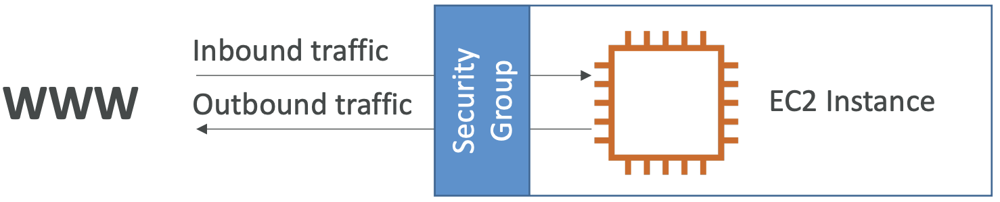
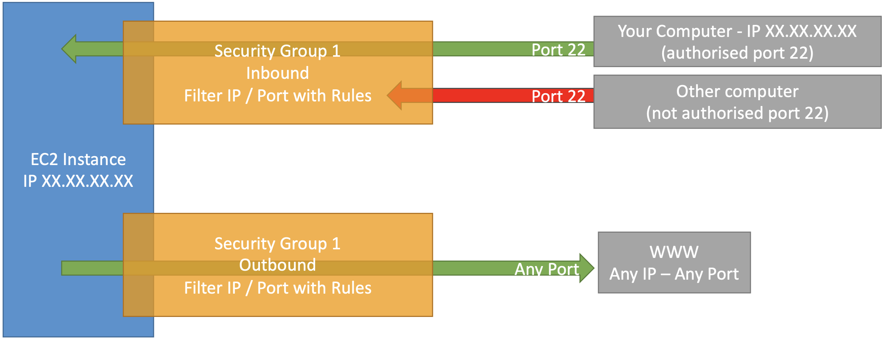
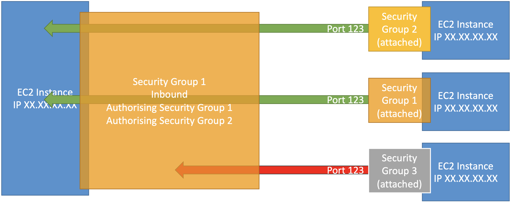

# Elastic Compute Cloud (EC2)

EC2 is one of the most popular service that AWS offers. Capabilities include:
- Renting virtual machines (EC2 instances)
- Storing data on virtual machines (EBS)
- Distributing load across machines (ELB)
- Scaling the services using an auto-scaling group (ASG)

## Sizing & Configuration Options
- Operating Systems (OS): Linux, Windows, Mac OS
- Compute power & cores (CPU)
- Random-access memory (RAM)
- Storage
  - Network-attached: EBS, EFS
  - Hardware: EC2 instance store
- Network card - speed, public IP address
- Firewall rules: security group
- Bootstrap script: EC2 User Data to configure instance at first launch

## EC2 User Data
- Bootstrap instances using script
- Launch commands when machine starts to automate boot tasks
- Always runs with root user
- Examples:
  - Install updates
  - Install software
  - Downloading common files
  
## Instance Types
**Naming Convention**  


### General Purpose
- Diverse workloads (e.g. web servers, code repositories)
- Balances between:
  - Compute
  - Memory
  - Networking

### Compute Optimized
- Compute-intensive tasks (high performance processors)
- Examples:
  - Batch processing workloads
  - Media transcoding
  - High performance web servers / computing (HPC)
  - Scientific modeling and machine learning
  - Dedicated gaming servers
  
### Memory Optimized
- Process large data sets in memory (RAM)
- Examples:
  - High performance, relational/non-relational databases
  - Distributed web scale cache stores
  - Real-time processing of big, unstructured data
  - In-memory databases optimized for business intelligence (BI)
  
### Storage Optimized
- High, sequential read and write access to large data sets in local storage
- Examples:
  - High frequency online transaction processing (OLTP) systems
  - Relational and NoSQL databases
  - Cache for in-memory databases (e.g. Redis)
  - Data warehousing applications
  - Distributed file systems
  
## Security Groups
- Network security (act as a __firewall__)
- Controls how traffic flows into or out of EC2 instances
- Regulates:
  - Access to ports
  - Authorized IP ranges (IPv4 and IPv6)
  - Inbound/outbound network
- Only contains `allow` rules
- Can reference by IP or security group
- Can be attached to multiple instances
- Linked to region and VPC combination
- Lives outside of EC2 - instances can't see blocked traffic
- (Best practice) should maintain separate security group for SSH
- Common errors:
  - Time out: security group issues
  - Connection refused: application errored or not launched
- Defaults:
  - Inbound traffic is blocked
  - Output traffic is authorized

**Basics**  


**Example**    


**Referencing Other Security Groups**  


### Classic Ports
- 22: SSH (secure shell) - log into a Linux instance
- 21: FTP (file transfer protocol) - upload files into a file share
- 22: SFTP (secure file transfer protocol) - upload files with SSH
- 80: HTTP - access unsecure websites
- 443: HTTPS - access secure websites
- 3389: RDP (remote desktop protocol) - log into Windows instance

#### SSH
- Allows control of remote machine
- Must use private key with 0400 access permissions
- Permissions 0644 error: access is too open (accessible to public)
  - Fix with `chmod 0400 <PEM FILEPATH>`

```
ssh ec2-user@<PUBLIC IPv4> # Permission denied
ssh -i <PEM FILEPATH> ec2-user@<PUBLIC IPv4> # SSH with private key
```

## Instances Purchasing Options

### On-Demand
- Predictable pricing (pay for what you use)
  - Linux and Windows: billing per second, after first minute
  - Other: billing per hour
- Highest cost
- No upfront payment
- No long-term commitment
- Recommended for:
  - **Short-term** and **un-interrupted** workloads
  - Can't predict how application will behave
  
### Reserved Instances
- Up to 75% discount compare to on-demand
- Must choose specific instance type
- Reservation period:
  - 1 year
  - 3 years (larger discount)
- Purchasing Options:
  - No upfront
  - Partial upfront (discounted)
  - All upfront (biggest discount)
- Recommended for: steady-state usage applications (e.g. databases)

#### Convertible Reserved Instance
- Can change the instance type and other parameters
- Up to 54% discount

#### Scheduled Reserved Instance
- Deprecated
- Only running/launched during a reserved time window (e.g. every Thursday, 3 - 6 PM)
- Recommended for: applications running for fraction of day / week / month

### Spot Instances
- Up to 90% discount compared to on-demand
- Most cost-efficient instances
- Can lose at any point in time if set max price is less than current spot price
- Recommended for: workloads resilient to failure
- Examples:
  - Batch jobs
  - Data analysis
  - Image processing
  - Any distributed workloads
  - Workloads with flexible start and end time
- Not recommended for: critical jobs or databases

### Dedicated Hosts
- Entire physical server dedicated to your own use
- Helps address **compliance requirements**
- Allows to **use your existing server-bound software licenses**
- Control instance placement
- 3 year reservation period
- More expensive
- Recommended for:
  - Software with complicated licensing model or "Bring Your Own License"
  - Strong regulatory or compliance needs
  
### Dedicated Instances
- Hardware dedicated to your own use
- Can share hardware with instances in same account
- No control over instance placement (hardware can move)
- No control over underlying hardware
