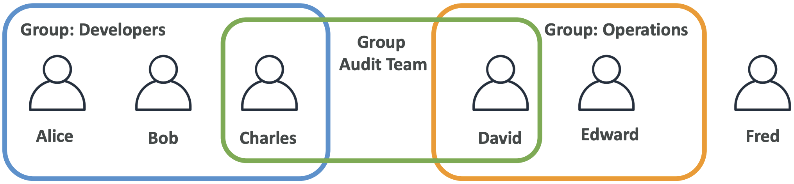
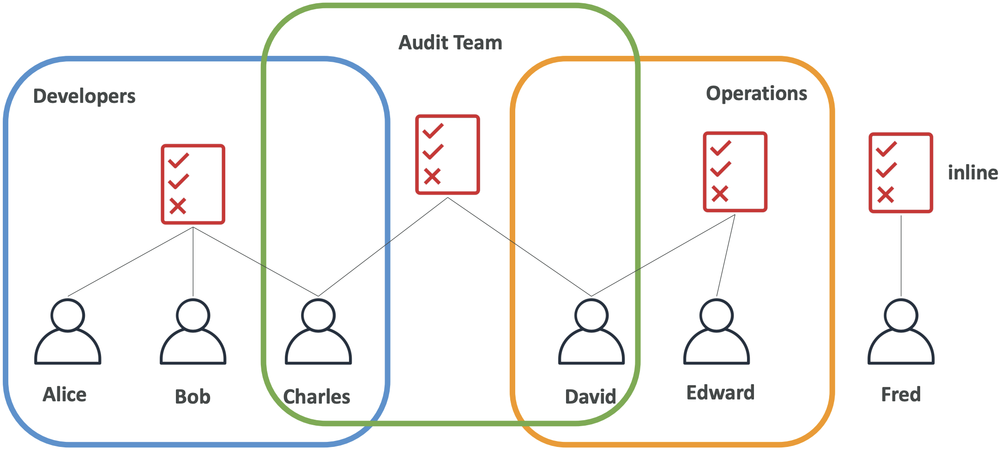
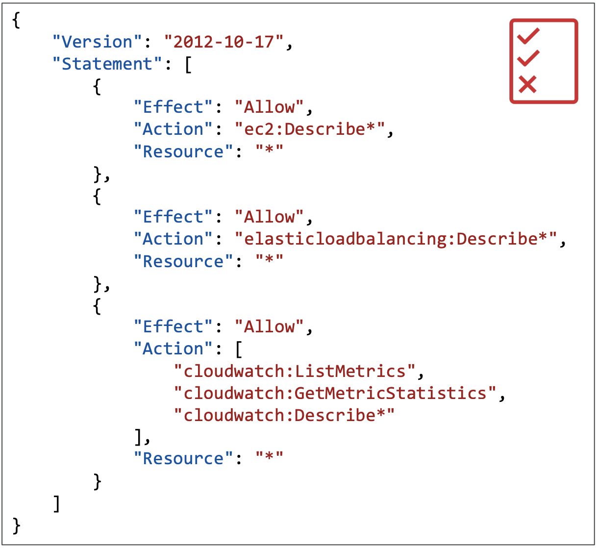
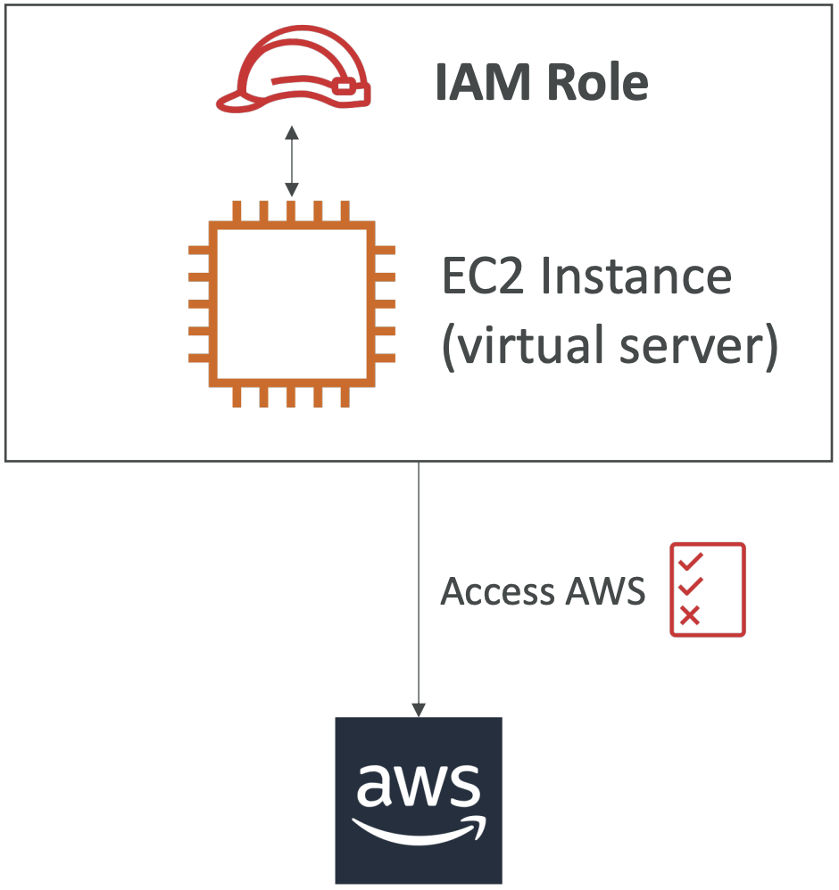

# IAM (Identity and Access Management)

IAM is a global service.

## Summary / Objectives
- Users: mapped to physical user with a password for the console
- Groups: contains users only
- Policies: JSON document that defines permissions for users or groups
- Roles: for services
- Security: password policy and MFA
- Access Keys: access AWS with CLI / SDK
- Audit: credentials report and access advisor

## Users
- People within organization
- Can be grouped
- Does not _have_ to belong to group (_not_ recommended)
- Can belong to multiple groups
- **Maximum of 5000 users per account**
- **IAM User can be a member of up to 10 groups**
- Use roles used when number of users / services is uncertain
- Each user must be explicitly given permissions (starts off without any permissions)
- Dedicated to account (can't access other accounts)
- **Globally resilient service (all data is secure across all aws regions)**

## Groups
- Contain users
- Cannot have sub-groups (groups within groups)

## Permissions
- Policies: JSON documents defining permissions to users/groups
- Least privilege principle: user given minimum level of access to perform job functions
- Priority of permissions:
  - Explicit DENY
  - Explicit ALLOW
  - Default DENY (implicit) (if no explicit allow -> no access is granted)

### Inheritance
- Group-level policy: all users inherit policy
- Inline policy: Only applied to user
  - Should only be used when special / exceptional allows or denies
- Managed policy: Reusable policies that can be applied to multiple users, groups, and roles

### JSON Structure
- Version: language version (usually 2021-10-17)
- Id: policy ID (optional)
- Statement: 1+ individual (required)
  - Sid: statement ID (optional)
  - Effect: flag indicating allow or deny access (Possible values: `Allow`, `Deny`)
  - Principal: account/user/role to apply policy to
  - Action: list of actions allowed/denied
  - Resource: list of resources actions are applied to
  - Condition: when policy is in effect (optional)
  

  
## Protection

### Password Policy
- Force users to set up passwords that adhere to specific policy
- Example:
  - Minimum password length
  - Require specific character types (uppercase, lowercase, numbers, etc.)
  - Expire passwords after some time
  - Prevent re-use
  
### MFA (Multi-Factor Authentication)
- Want to protect root accounts and IAM users
- Security device used in addition to password
- Benefits:
  - Better security than just a password
  - Account not technically compromised if MFA enabled
- Device options:
  - Virtual MFA device: app installed on mobile device or computer that supports multiple tokens (multiple IAM users)
  - Universal Second Factor (U2F) security key: physical device that supports multiple root and IAM users with single security key (Example: YubiKey)
  - Hardware key fob: physical device with single token (Example: Gemalto)
  - Hardware key fob for AWS GovCloud: special key fob for government officials/compliance
- Common factors:
  - Knowledge - something you know, usernames, passwords
  - Possession - something you have, bank card, MFA device/app
  - Inherent - something you are, fingerprint, face, voice, or iris
  - Location - location (physical), which network (corp or wifi)

## Roles
- Grant permission to entities within AWS
- Examples:
  - IAM user in another account
  - Applications (EC2 instance, Lambda function, etc.)
  - Services that need access to other resources
  

## Access Keys
- Long term credentials
- Used for CLI access
- IAM user can have as most 2 access keys
- Can be created, deleted, mark as inactive, or mark as active
- Must store secret access key at time of creation - cannot download later
- IAM roles don't use access keys - only users

## Security Tools

### Credentials Report
- Account level
- Lists all users within account and status of their credentials

### Access Advisor
- User level
- Shows user's service permissions and when those services were last accessed
- Important for least privilege principle

## Best Practices
- Don't use root account (except for account setup)
- 1 physical user per AWS user
- Assign users to groups
- Assign permissions to groups
- Create a strong password policy
- Enforce MFA
- Create and use roles for AWS services permissions
- Use access keys for programmatic access (CLI / SDK)
- Audit permissions with credentials report
- Never share IAM users or access keys
