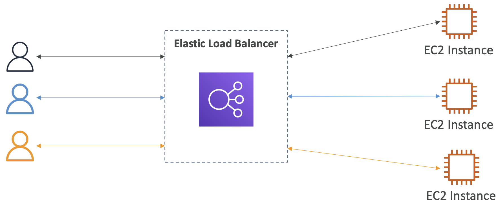
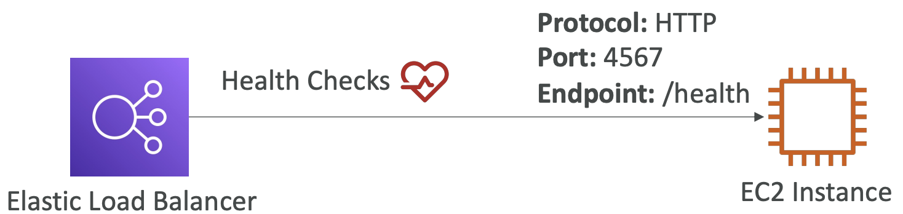
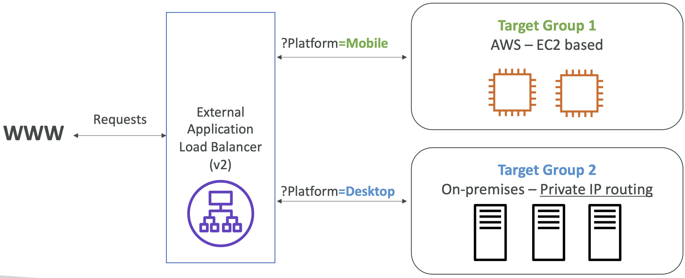
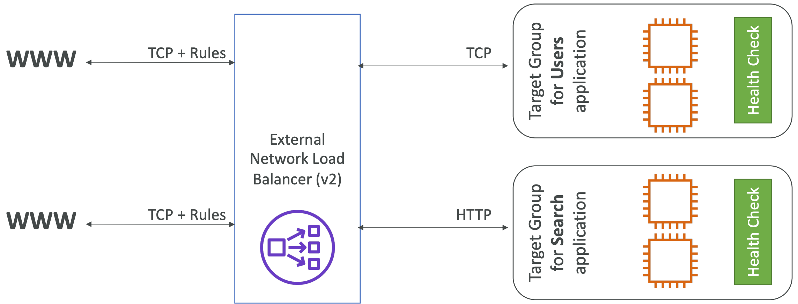

# Scalability & High Availability

## Scalability
Application/system can adapt to handle greater loads.

Scalability types:
- Vertical
- Horizontal (elasticity)

### Vertical Scaling
- Increase size of instance
- Use cases: common for non-distributed systems (e.g. databases, RDS, ElastiCache)
- Usually has upper limit because of hardware
- Example: application runs on t2.micro then increase to t2.large

### Horizontal Scaling
- Increase number of instances/systems
- Scaling in: decrease number of instances
- Scaling out: increase number instances
- **Distributed systems**
- Use cases:
  - Common for web/modern applications (e.g. EC2)
  - Auto scaling group
  - Load balancer

## High Availability
- Running app/system in at least 2 data centers (AZs)
- Goal: isolate failure (data center loss)
- __Usually__ goes hand-in-hand with horizontal scaling
- Use cases:
  - Auto scaling group with multi-AZ enabled
  - Load balancer with multi-AZ enabled

High Availability Types:
- Passive
  - System has primary instance, data is replicated to standby instance(s) in a different AZz  
  - Example: RDS Multi-AZ deployment
- Active
  - Horizontal scaling
  - All instances are handling traffic at the same time
  
## Load Balancing
- Servers that forward traffic to multiple backend servers downstream
- Users don't see this, only have one point of connectivity
- Some load balancers can be set up as internal (private) or external (public) ELBs

   

**Why Use A Load Balancer?**
- Spread load across multiple downstream instances
- Expose 1 point of access (DNS) to app
- Handle failures of downstream instances with health checks
- SSL termination (HTTPS encryption)
- Stickiness with cookies
- High availability across AZs
- Separate public from private traffic

**Why Use Elastic Load Balancer?**
- Managed load balancer by AWS
- Guaranteed to be working
- AWS handles upgrades, maintenance, high availability
- Costs less than to set up own load balancer
- Integrated with other AWS services

### Health Checks
- Verifies if server/instance is properly working
- Crucial to load balances: knowledge of which instance it cannot send traffic to
- Checks endpoint on a port (expects 200/OK response for healthy instances)

### Security Groups
- Load balancer allows traffic from users anywhere using HTTPS/HTTP
- EC2 instances only allow traffic from load balancer (source: security group)

### Types of Load Balancers
- Classic (deprecated - 2009)
- Application (2016)
- Network (v2 - net generation - 2017): TCP, TLS, UDP
- Gateway (2020): Layer 3 (network), IP protocol

#### Classic Load Balancer (CLB)
- Deprecated
- v1 - old generation
- Supports:
  - HTTP/HTTPS (Layer 7)
  - TCP (Layer 3)
  - SSL (secure TCP)
- Health checks: TCP or HTTP based
- Need one CLB __per__ application
- Fixed hostname (e.g. xxx.region.elb.amazonaws.com)

#### Application Load Balancer (ALB)
- v2 - new generation
- Supports:
  - HTTP (Layer 7)
  - WebSocket
- Balances:
  - Multiple HTTP apps across machines grouped together (target groups)
  - Multiple apps on same machine (e.g. containers, ECS)
- Automatically redirects HTTP to HTTPS
- Routing table for different target groups:
  - URL path (example.com<b>/users</b>, example.com<b>/posts</b>)
  - Hostname (**one.example.com**, **other.example.com**)
  - Query strings, headers (example.com/users**?id=123&order=false**)
- Great for:
  - Micro-services
  - Container-based apps (e.g. Docker, ECS)
  - Setting forwarding rules
- **Only need one ALB for multiple apps**
- Fixed hostname (e.g. xxx.region.elb.amazonaws.com)
- Application servers see ALB information - client info is in headers
  - IP: `X-Forwarded-For`
  - Port: `X-Forwarded-Port`
  - Proto: `X-Forwarded-Proto`

**HTTP Traffic**  

**Target Groups**
ALB can route to multiple target groups. HTTP checks are at target group level.

- EC2 instances: HTTP - managed by Auto Scaling Group
- ECS tasks: HTTP - managed by ECS
- Lambda functions: HTTP - request translated into JSON
- Private IP addresses

**Query Strings Traffic**  

#### Network Load Balancer (NLB)
- Can handle millions of requests per second
- Supports:
  - TCP/UDP (Layer 4)
  - TLS
- Little latency ~100ms (vs. 400 ms for ALB)
- Fixed IP per AZ (dedicated - multiple entry-points)
- Can assign Elastic IP (helps with whitelisting specific IPs)
- Useful for:
  - Extreme performance
  - TCP/UDP traffic
  
**TCP Traffic**  

**Target Groups**
- EC2 instances
- Fixed, private IP addresses: useful for servers on your own data centers
- ALBs: useful for setting static IP addresses

#### Gateway Load Balancer (GLB)
- Deploy, scale, and manage multiple third-party network virtual appliances
- Functionality:
  - Transparent Network Gateway: single entry and exit for all traffic
  - Load Balancer: distributes traffic to virtual appliances
- **GENEVE protocol on port 6081**
- Supports: Network Layer (Layer 3): IP packets
- Examples:
  - Firewalls
  - Intrusion Detection and Prevention Systems
  - Deep Packet Inspection Systems
  - Payload manipulation
  

**Target Groups**
- EC2 instances
- Private IP addresses: useful for servers on your own data centers

## Sticky Sessions (Session Affinity)
- Same client is always directed to the same instance behind the load balancer
- Cookie is used with an expiration date
- Can cause imbalance in traffic load
- Use case: keep session data (e.g. login info)

### Types of Cookies
**Application-based cookies**
- Custom cookie
  - Generated by app
  - Can include custom attributes for app
  - Specified individually for each target group
  - Reserved names: AWSALB, AWSALBAPP, AWSALBTG
- Application cookie
  - Generated by load balancer
  - Name: AWSALBAPP

**Duration-based cookies**
- Generated by load balancer
- Name: AWSALB (ALB) or AWSELB (CLB)
- Expires after duration set by load balancer

## Cross-Zone Load Balancing
Distributes traffic evenly across all instances in all AZs

Application Load Balancer
- Always on (can't be disabled)
- No charges for cross-AZ data

Network Load Balancer
- Default: disabled
- Pay for cross-AZ data

Classic Load Balancer
- Default: disabled
- No charges for cross-AZ data

